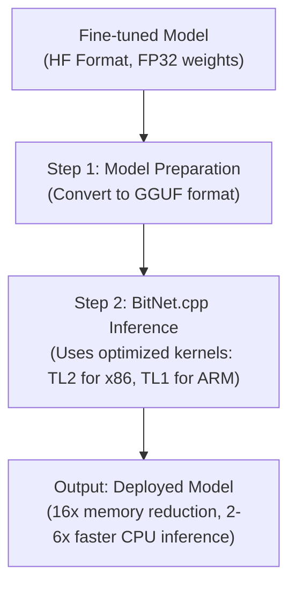

# BitNet Fine-Tuning on IMDB

This repository fine-tunes a small pretrained transformer (`DistilBERT`) into a **BitNet-style model with ternary weights** for sentiment classification on the IMDB dataset. It replaces all linear layers with custom `BitLinear` layers that quantize weights to `{-1, 0, 1}` during forward passes, using straight-through estimator for backpropagation.

## Why BitNet?
- Extreme weight quantization (1.58-bit) reduces memory footprint.

| Model | Parameter Count | Estimated Memory (MB) |
|-------|----------------|----------------------|
| DistilBERT (FP32) | 67M | 67M × 4 bytes (per param) = 256 |
| BitNet (ternary) | 67M | 67M × 0.25 bytes (per param) = 16 |

Compression ratio: ~16x

# Deployment 



## Convert to GGUF

1. bitnet.cpp uses the GGUF format. You must convert your fine-tuned Hugging Face model.

   Get the bitnet.cpp framework which contains the necessary conversion script
   
   ```bash
   git clone https://github.com/microsoft/BitNet.git
   cd BitNet
   pip install -r requirements.txt
   ```
2. Run the Conversion Script
Use the provided convert-hf-to-gguf-bitnet.py script. Point it to the directory where you saved your fine-tuned model (e.g., ./bitnet-imdb-finetuned)

	```bash
	python convert-hf-to-gguf-bitnet.py /path/to/your/bitnet-imdb-finetuned
	```
	
## Run Inference with bitnet.cpp
1. Run Inference with bitnet.cpp

Now we can use the framework to run your model with massive efficiency gains. The framework will automatically use the best kernel for your CPU

- Set Up the Environment
The setup_env.py script detects hardware and prepares the optimized kernels

	```bash
	python setup_env.py --hf-repo /path/to/your/bitnet-imdb-finetuned --cpu-type your_cpu_type

	```
2. Run Inference
use the run_inference.py script to prompt the model. This will load the GGUF file and execute it using the specialized, high-performance kernels

	```bash
	python run_inference.py -m /path/to/your/model.gguf -p "Prompt Here"
	```
	
## Expected Performance Gains	
| Metric | Expected Improvement | Notes |
|--------|----------------------|-------|
| Model Memory Footprint | ~16x reduction | Your 268 MB model drops to ~16 MB. |
| Inference Speed | 2.37x - 6.17x faster (on x86 CPUs) | Realized through optimized kernels. |
| Energy Consumption | 71.9% - 82.2% reduction (on x86 CPUs) | Less memory movement and simpler arithmetic. |
	


## Quickstart (Colab)
[](https://colab.research.google.com/github/shrisha-rao/bitnet-imdb/blob/main/notebooks/bitnet_imdb_colab.ipynb)


## Local Setup
```bash
git clone https://github.com/yourusername/bitnet-imdb.git
cd bitnet-imdb
pip install -r requirements.txt
python train.py --max_samples 5000   # quick test


# Files

    src/bitlinear.py – Implements BitLinear, a ternary weight layer with STE.

    src/utils.py – Function to recursively replace nn.Linear with BitLinear.

    src/train.py – Training script (uses IMDB dataset, Hugging Face Trainer).

    notebooks/bitnet_imdb_colab.ipynb – Same logic in a Colab-friendly format.
